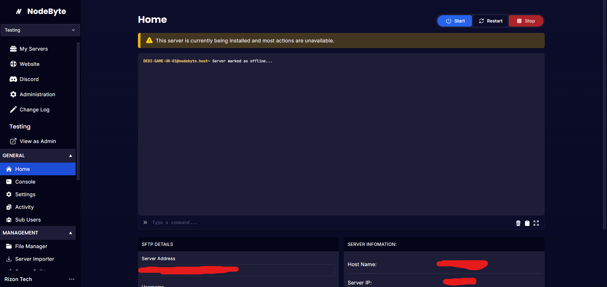
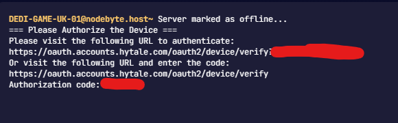
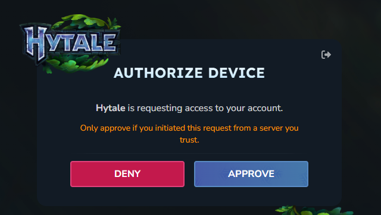
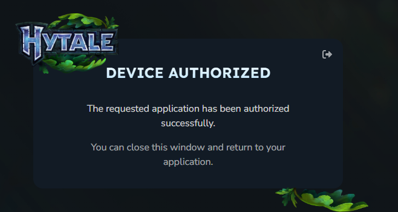
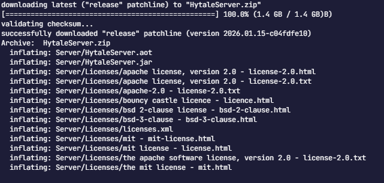

Please note the below is temporary and will be changed in the near future.

# Installing

Once you have purchased Hytale you will need to quickly make your way to the panel and sign in. 

Once you are signed in open your hytale server.

Once loaded you will be greeted by this page:

It may seem it's not doing anything, but there is a delay of 1 minute for the panel to provide you with a authorization code for the downloader to continue. 

Once you see this:

Click on the first link to authorize the server.

You will be taken to this page below - Click on "Approve" then sign in (if required). 

Once approved you will be greeted by this page - You may close this tab

Back on the panel the server will begin to install.

# Logging in on the panel

Once the installaion is complete please run `auth login device`

You will then be taken back to this page. Click on approve.

Once you see this page you can close the tab. 

Back on the panel run `auth persistence Encrypted` this will save your details to the files encryted. Failing to do this means you will have to sign in everytime the server is rebooted. 

That's it! Enjoy playing on a Hytale server!