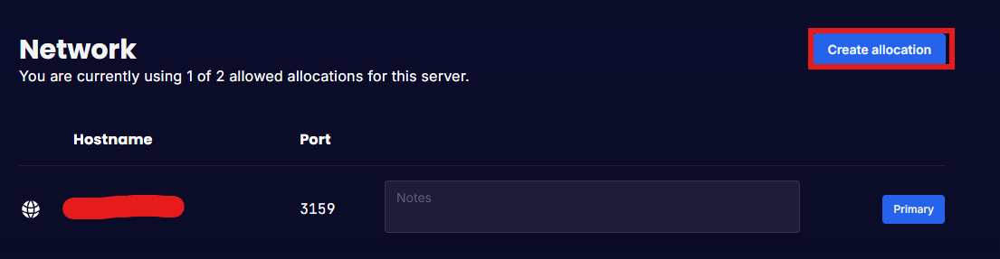
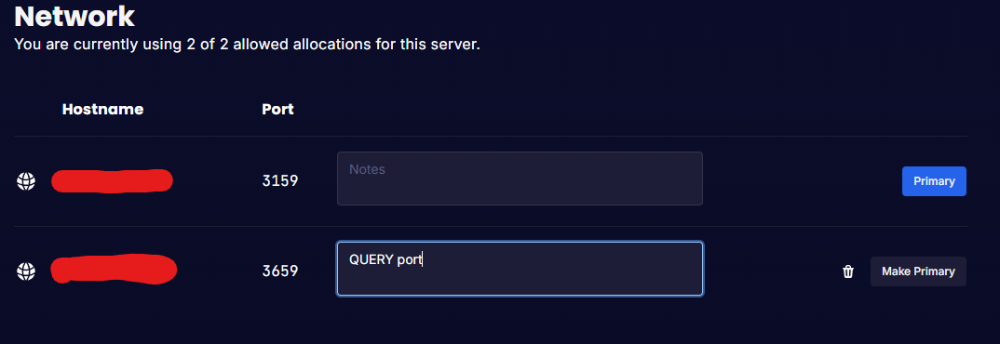
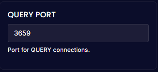

## QUERY Port

You are provided one free allocation per Rust server for your QUERY port. 

To do this please follow the below

1. Open [BytePanel](https://panel.nodebyte.host)

2. Load up your Rust Server

3. Go to the "Network" Tab

4. Click on "Create allocation"

5. Add a note so you know what this is being used for (optional)

6. Once you have created the Allocation go to the "Startup" tab and look for "QUERY PORT" then enter the PORT provided

7. Start/Restart your server for the changes to take affect

## Rust+ Port

If you would like to use Rust+ you must contact our [Support Team](https://nodebyte.host/submitticket.php) to get one applied to your server.

Once you placed the ticket, the support team will take it from there and will have it ready for you to just start/restart your server. 😄